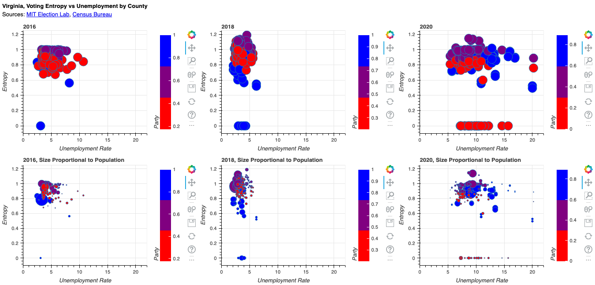

# Political Polarization in Virginia, 2016-2020

I'm curious about polticial polarization, which is in the news a lot these days, and wondering whether it's a factor in my home state of Virginia. Is political polarization getting worse (or better) in Virginia? How does it compare across counties and population centers? Does it relate to economic conditions? I should hasten to add, I'm not a political scientist! I did the number crunching in Python with Pandas and Numpy and did the visualization in Bokeh (which incorporates some cool interactive features--see the link below). 

I pulled voting data from the MIT Election Lab, for the 2016, 2018 2020 House and Senate races (these are their latest data). These data were organized by precinct, so I aggregated them to county level (which includes absentee ballots). I included Independent and Libertarian party candidates but not write-ins; I wasn't sure it made sense to lump all write-ins together since they may represent very diverse political orientations. I joined this to data on unemployment (June of each year--not seasonally adjusted) and population (2020) by county from the Census Bureau.

For each county, year and race, I measured political polarization via entropy, as

$$entropy\ for\  county\  j\  in\  year\  t = -\sum_{i,j,t} p_{i,j,t} log_2(p_{i,j,t}),$$
$$p_{i,j,t}=vote\ share\ of\ party\ i\ in\ year\ t\,$$
$$i = 1,.,N\ parties,\ j=1,...,M\ counties,\ t=2016,2018,2022$$.

Entropy measures the dispersion or complexity of a discrete distribution. For example, in a race where one candidate receives all the votes, entropy is zero. In a two-party race where each gets an equal number of votes, entropy is 1. In a three-party race where each gets one-third of the vote, entropy is about 1.6. Accordingly, entropy is a better measure of dispersion than (say) the difference in Democratic vs Republican votes, as it accounts for third-party votes as well as the concentration of votes in individual parties. 

TLDR :) lower entropy is less dispersed and thus (my interpretation) more polarized. Zero is the most polarized (entropy can't be negative) 

I also measured the party leaning for each county, year, and race as the share of Democratic votes and used this to color the associated circles on the chart--see the scale on the right hand side of each chart.

The interactive visualization with all the Bokeh bells and whistles like zooming and panning is [here:](https://charlie-kramer.github.io/va_voting_entropy/). Here's a static version:

Having a broad look at the charts, it's clear that entropy is measuring something different than Democratic/Republican shares--look at how the colors are distributed vs entropy. That said, it's not surprising that the purple ones are at the top. 

Looking at the top row first--in this one, the circles representing counties are not sized by population--it looks as if polarization has increased over time, as represented by the amount of circles falling at zero. It's interesting that these circles are blue or red in various years--e.g. representing both parties. There are a lot of red circles at zero in 2020; this is because the Republican candidate for District 9 ran [unopposed](https://en.wikipedia.org/wiki/2020_United_States_House_of_Representatives_elections_in_Virginia#District_9).

That said, and abstracting from the developments in that district, there was what looks like a significant shift from 2016 to 2018, with a lot of blue counties becoming more polarized. It's also interesting that polarization doesn't seem to have much to do with economic conditions, as measured by the unemployment rate; there's a good spread of entropy at each level of unemployment. 

Next, looking at the bottom row, we can see that the most-polarized counties (red or blue) tend to be the smaller ones. 

If you click on the link above, you can see the version where you can hover over the circles to see the name of the county and the source data. 

Curious to know what you think about this! Drop me a line if you have interest and time.

